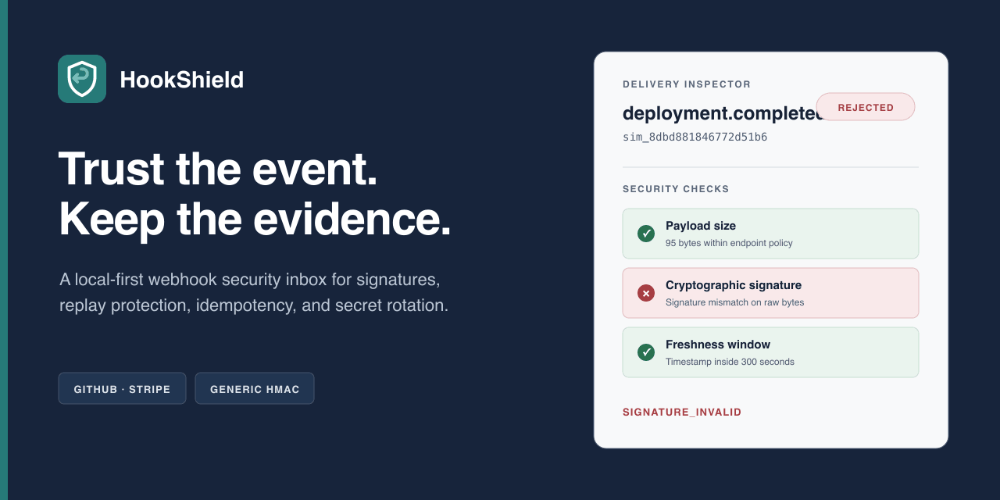
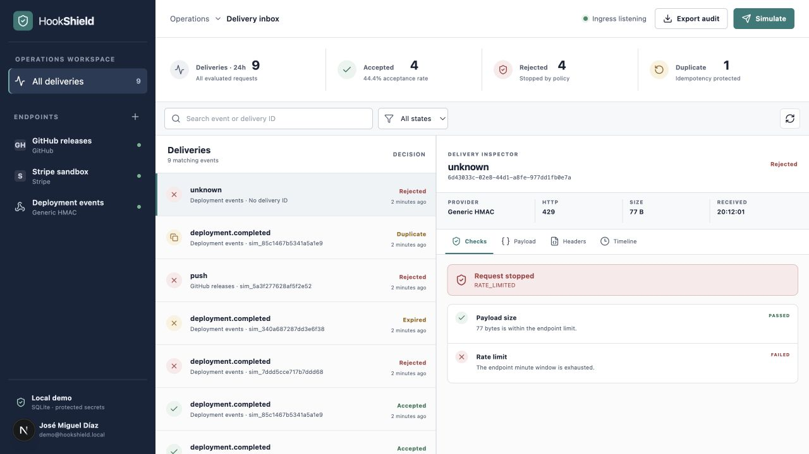
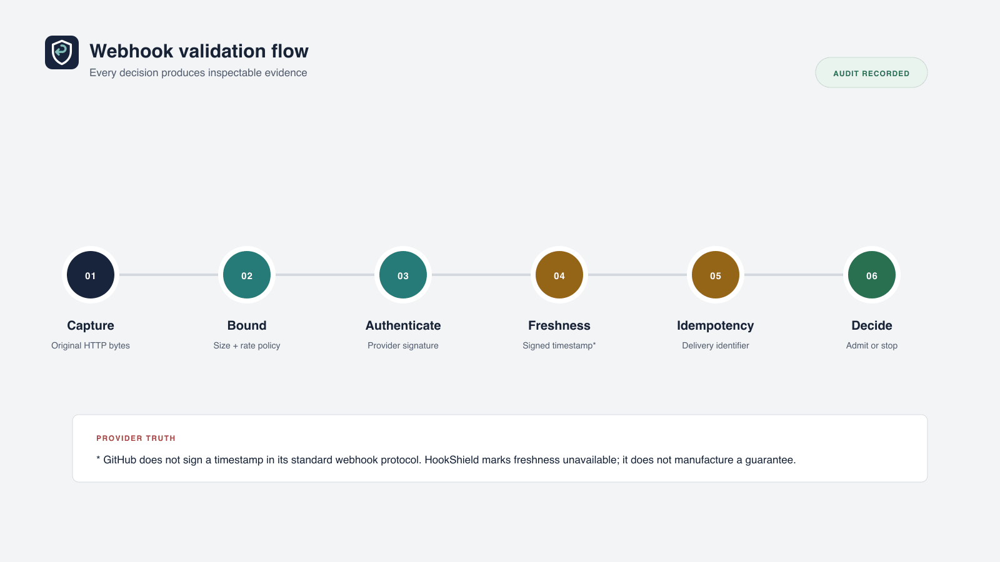
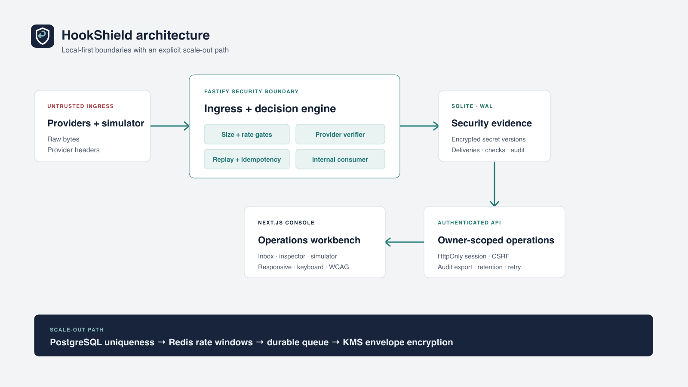

<p align="center">
  
</p>

<p align="center">
  <strong>See why a webhook was trusted before your application acts on it.</strong><br />
  A local-first AppSec portfolio MVP by <a href="https://github.com/JMDcore">José Miguel Díaz</a>.
</p>

<p align="center">
  <a href=".github/workflows/ci.yml"></a>
  <a href="LICENSE"></a>
  
  
</p>

HookShield is a visual inbox and policy boundary for incoming webhooks. It captures the original request bytes, verifies provider signatures, evaluates freshness and idempotency, records every security decision, and lets an operator inspect the evidence in one dense console.

It is intentionally described as a **professional portfolio MVP**, not a production gateway. The demo needs no Docker, cloud account, public tunnel, Redis, or PostgreSQL.

## Try it in under five minutes

Requirements: Node.js 22+ and pnpm 11+.

```bash
git clone https://github.com/JMDcore/JMD-HookShield.git
cd JMD-HookShield
pnpm install
pnpm demo
```

Open [http://localhost:3000](http://localhost:3000). Demo authentication is automatic and limited to `HOOKSHIELD_DEMO_MODE=true`. Every run rebuilds a synthetic SQLite dataset; all included keys and webhook secrets are test-only.

From **Simulate**, generate a valid event, bad signature, tampered payload, stale timestamp, duplicate, replay attempt, oversized body, rate-limit rejection, or a valid event after secret rotation.



## What the MVP demonstrates

- GitHub `X-Hub-Signature-256` verification over the untouched body and `X-GitHub-Delivery` idempotency.
- Stripe verification through the official SDK, including the signed timestamp and configurable tolerance.
- A documented Generic HMAC protocol that signs `timestamp.delivery-id.raw-body` with HMAC-SHA256.
- Constant-time equality, missing/malformed signature handling, payload caps, and endpoint rate limits.
- AES-256-GCM secret encryption with an environment-only master key.
- Versioned secret rotation with a bounded previous-version transition window.
- Append-only duplicate and replay evidence instead of silent discards.
- Owner-scoped dashboard access, expiring `HttpOnly` sessions, strict cookies, origin-bound CSRF checks, CSP, and redacted headers.
- Controlled internal processing, retry limits, JSON audit export, and configurable retention purge.
- A real operations UI with keyboard list navigation, responsive layout, loading/error/empty states, and automated WCAG checks.

## Validation pipeline

<p align="center">
  
</p>

Signatures are checked before JSON is trusted. A provider adapter then supplies the delivery ID, event type, and—where the protocol supports it—a signed timestamp. HookShield decides whether to admit, reject, expire, or deduplicate the delivery and persists the checks that led to that result.

GitHub's standard signature does **not** include a signed timestamp. HookShield therefore authenticates its raw body and deduplicates its delivery ID, while explicitly recording freshness as unavailable instead of inventing a guarantee.

## Architecture

<p align="center">
  
</p>

```text
apps/web        Next.js operations console
apps/api        Fastify ingress, auth, simulator, and decision engine
packages/       Contracts, consolidated security primitives, SQLite persistence
tests/e2e       Browser-level product and accessibility tests
docs/           Threat model, protocols, guides, diagrams, and launch material
```

The MVP stays synchronous and single-node on purpose. See [Architecture](docs/architecture.md), [Threat model](docs/threat-model.md), and [Design system](DESIGN.md) for the boundaries and trade-offs.

## Test real providers optionally

- [GitHub CLI forwarding](docs/providers.md#github-cli-forwarding) uses the official `cli/gh-webhook` extension against a repository you own or are authorised to test.
- [Stripe CLI sandbox](docs/providers.md#stripe-cli-sandbox) forwards sandbox events and uses its printed signing secret.
- [Generic HMAC CLI](docs/providers.md#generic-hmac-cli) runs entirely against localhost with the included sender.

The built-in simulator remains the recommended path because it is deterministic, offline from providers, and includes negative security cases.

## Quality checks

```bash
pnpm typecheck
pnpm test
pnpm test:e2e
pnpm build
pnpm audit
```

The test suite covers valid, missing, incorrect, modified, stale, duplicated, rotated, oversized, rate-limited, cross-user, redaction, encryption, retention, retry, consistent-error, full simulator, and accessibility paths. See [Testing](docs/testing.md).

## Security model

The main threats are forged signatures, timing leakage, replay, duplicate processing, secret disclosure, cross-user access, unbounded input, log injection, session attacks, and excessive retention. Controls and residual risks are recorded in the [threat model](docs/threat-model.md).

HookShield never forwards to arbitrary URLs in this MVP. That feature was rejected to avoid creating an SSRF surface before a proper egress policy and network sandbox exist.

Please report security issues using [SECURITY.md](SECURITY.md), not a public issue.

## Limits and roadmap

Current limits are explicit:

- SQLite, in-memory rate windows, and process-local consumers are single-node controls.
- Delivery uniqueness is guaranteed by the single local decision engine, not a distributed database constraint.
- There is no KMS/HSM integration, SSO, multi-tenant billing, or arbitrary webhook forwarding.
- Payload inspection is JSON-focused and retention purge is invoked locally rather than by a durable scheduler.

The next credible steps are PostgreSQL uniqueness, Redis-backed distributed limits, a durable processing queue, envelope encryption via KMS, OIDC/SSO, scheduled retention, and carefully sandboxed destinations. See the [roadmap](docs/roadmap.md).

## Project documentation

- [Demo and simulator](docs/demo.md)
- [Provider setup](docs/providers.md)
- [Generic HMAC protocol](docs/generic-hmac.md)
- [Architecture](docs/architecture.md)
- [Threat model](docs/threat-model.md)
- [Testing guide](docs/testing.md)
- [Roadmap](docs/roadmap.md)
- [Contributing](CONTRIBUTING.md)

## License

[MIT](LICENSE) © 2026 José Miguel Díaz.
